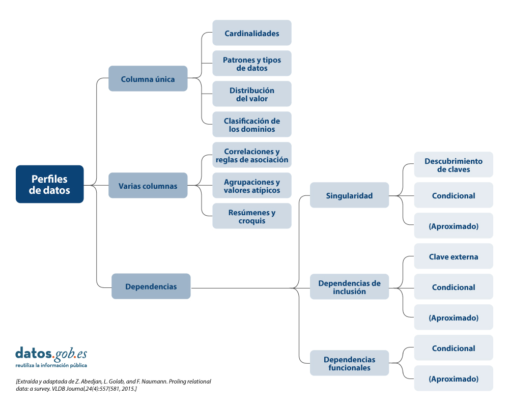

# **Tipoa de perfilado **

## **1. Perfiles de Datos por Columna Única**

Estos perfiles se enfocan en analizar una sola columna (atributo) de una tabla o conjunto de datos.

### 1.1. Cardinalidades
- **Definición**: Mide la cantidad de valores únicos y repetidos en una columna. Indica si hay muchos duplicados o si todos los valores son distintos.
- **Ejemplo**: En una columna `DNI` de una tabla de usuarios, si hay 1000 registros pero solo 950 valores únicos, significa que 50 personas tienen DNI duplicado (lo cual podría ser un error).

### 1.2. Patrones y tipos de datos
- **Definición**: Identifica el tipo de dato almacenado (texto, número, fecha, booleano) y patrones comunes (ej. formato de correo, teléfono, código postal).
- **Ejemplo**: En una columna `Email`, el perfil puede revelar que el 98% de los valores siguen el patrón `nombre@dominio.com`, pero el 2% contiene errores como `nombre@dominio` (sin .com).

### 1.3. Distribución del valor
- **Definición**: Muestra cómo se distribuyen los valores en la columna: frecuencia, rango, percentiles, valores atípicos, etc.
- **Ejemplo**: En una columna `Edad`, se puede observar que el 70% de los valores están entre 25 y 45 años, y hay algunos valores extremos como 120 o -5 (posibles errores).

### 1.4. Clasificación de los dominios
- **Definición**: Agrupa los valores según su significado o categoría (dominio semántico). Ayuda a entender si los datos pertenecen a un conjunto esperado.
- **Ejemplo**: En una columna `País`, se espera que los valores sean nombres de países reconocidos (España, México, etc.). Si aparece "México City" o "USA", puede indicar inconsistencia.

---

## **2. Perfiles de Datos por Varias Columnas**

Analizan relaciones y comportamientos entre dos o más columnas.

### 2.1. Correlaciones y reglas de asociación
- **Definición**: Mide la relación estadística entre columnas (correlación) o descubre reglas de asociación (si A ocurre, entonces B tiende a ocurrir).
- **Ejemplo**: En una base de ventas, se puede encontrar que cuando se compra “Pan”, también se compra “Leche” en el 65% de los casos (regla de asociación).

### 2.2. Agrupaciones y valores atípicos
- **Definición**: Identifica grupos naturales de datos (clustering) y detecta valores que se desvían significativamente del comportamiento esperado.
- **Ejemplo**: En una tabla de salarios por departamento, se puede agrupar por departamento y detectar que un empleado en “Marketing” gana 3 veces más que el promedio del área — posiblemente un error o caso especial.

### 2.3. Resúmenes y croquis
- **Definición**: Proporciona estadísticas resumidas (media, mediana, desviación estándar) o visualizaciones rápidas (histogramas, boxplots) para múltiples columnas.
- **Ejemplo**: Un resumen de las columnas `Precio`, `Cantidad` y `Total` muestra que el precio promedio es 50€, con una desviación estándar alta, lo que sugiere mucha variabilidad en los precios.

---

## **3. Perfiles de Datos por Dependencias**

Analizan relaciones lógicas o funcionales entre columnas, fundamentales para la integridad y diseño de bases de datos.

### 3.1. Singularidad
- **Definición**: Verifica si una combinación de columnas puede actuar como clave única (identificador único de filas).
- **Subtipos**:
  - **Descubrimiento de claves**: Busca conjuntos mínimos de columnas que identifican de forma única cada fila.
    - *Ejemplo*: En una tabla de pedidos, la combinación `(ID_Cliente, Fecha_Pedido)` podría ser única.
  - **Condicional**: Evalúa si una clave es única bajo ciertas condiciones (por ejemplo, solo para un país específico).
    - *Ejemplo*: `(DNI)` es único solo si el país es “España” (no válido en otros países).
  - **(Aproximado)**: Cuando la singularidad no es exacta, pero casi (por ejemplo, 99.8% de las filas son únicas).
    - *Ejemplo*: En una tabla de correos, el campo `email` es casi único, pero hay 0.2% de duplicados por errores de carga.

### 3.2. Dependencias de inclusión
- **Definición**: Verifica si los valores de una columna están contenidos en otra (similar a claves foráneas).
- **Subtipos**:
  - **Clave externa**: Confirma que los valores de una columna existen en otra tabla (relación referencial).
    - *Ejemplo*: La columna `ID_Departamento` en la tabla `Empleados` debe estar contenida en la tabla `Departamentos.ID`.
  - **Condicional**: Solo válida bajo ciertas condiciones.
    - *Ejemplo*: `ID_Sucursal` en `Ventas` debe existir en `Sucursales` solo si `Pais = 'España'`.
  - **(Aproximado)**: Cuando la dependencia no es exacta (por ejemplo, 97% de los valores coinciden).
    - *Ejemplo*: En una tabla de facturas, el 97% de los `ID_Cliente` existen en la tabla de clientes, pero el 3% son inválidos.

### 3.3. Dependencias funcionales
- **Definición**: Establece que el valor de una columna determina el valor de otra (X → Y).
- **Subtipos**:
  - **Condicional**: La dependencia funcional solo se cumple bajo ciertas condiciones.
    - *Ejemplo*: `Codigo_Postal → Ciudad` solo si `Pais = 'España'`.
  - **(Aproximado)**: La dependencia no se cumple siempre, pero en la mayoría de los casos.
    - *Ejemplo*: `DNI → Nombre` es aproximadamente verdadero, pero hay casos donde el mismo DNI tiene nombres diferentes por errores de carga.

---

## Conclusión

El perfilado de datos es una herramienta poderosa para:

- Entender la calidad y estructura de los datos.
- Detectar errores, inconsistencias y anomalías.
- Validar supuestos sobre relaciones entre columnas.
- Preparar datos para análisis, integración o migración.

Cada tipo de perfil (columna única, varias columnas, dependencias) ofrece una perspectiva diferente, y juntos forman un mapa completo de la salud y utilidad de un conjunto de datos.
